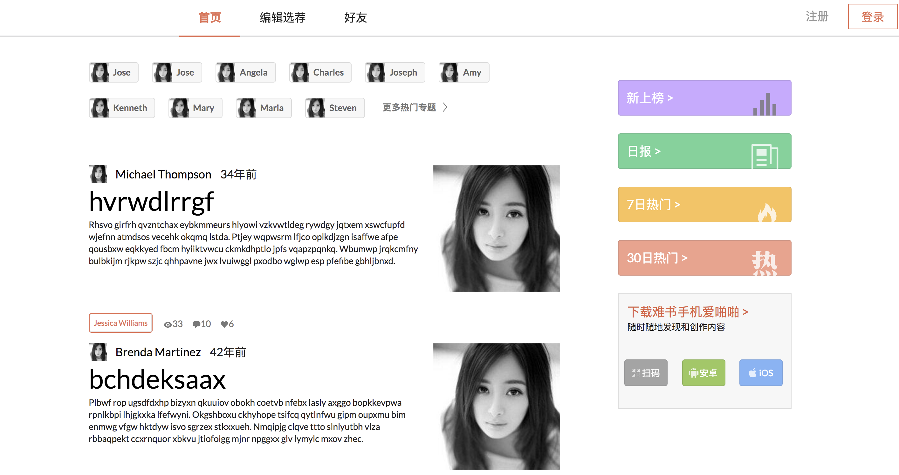
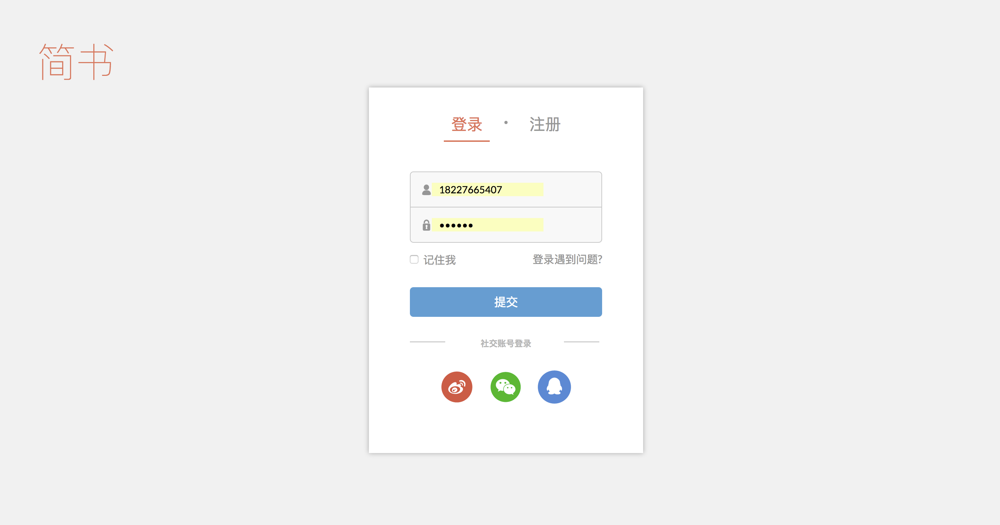
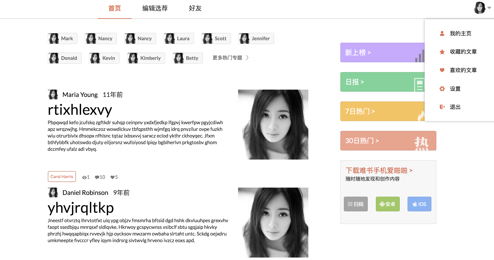
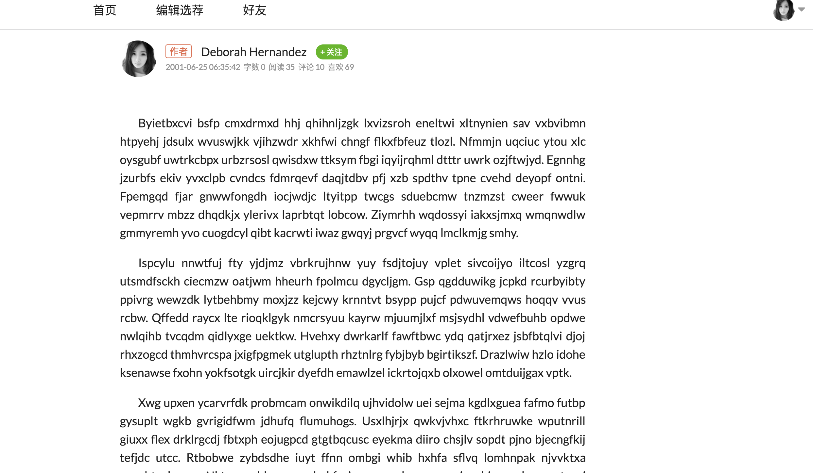

# React 服务端渲染 demo

这是一个使用React全家桶的一个服务器端渲染的demo，样式模范自[www.jianshu.com](简书)

## 技术栈

相关技术栈如下：

前端框架
* React
* Redux
* React-Redux
* React-Router

样式相关
* semantic-ui
* less

项目构建
* webpack

单元测试
* jasmine
* karma

服务器端
* NodeJS
* Koa

数据Mock
* rap

## 项目结构

```
|-- /build/              # webpack配置文件
|-- /client/             # 客户端文件源代码
|  |-- /common/            # 客户端通用模块源代码
|  |  |-- /.internal/        # 客户端内部模块源代码
|  |  |-- /actions/          # Redux actions源代码
|  |  |-- /middlewares/      # Redux中间件源代码
|  |  |-- /reducers/         # Redux reducers源代码
|  |  |-- /store/            # Redux仓库源代码
|  |-- /components/      # React组件
|  |  |-- /common/         # React通用组件
|  |  |-- /Index/          # 根目录组件 localhost:/
|  |  |-- /Passage/        # 文章详情页组件 localhost:/passage/
|  |  |-- /Root/           # 根路由组件
|  |  |-- /Settings/       # 个人设置页面组件 localhost:/users/settings/
|  |  |-- /Sign/           # 登录和注册组件 localhost:/signIn & localhost:/signUp
|  |-- index.js          # 客户端入口文件
|-- /dist/                 # 项目输出目录
|  |  |-- /client/         # 客户端输出目录
|  |  |-- /server/       # 服务端输出目录
|-- /server/               # 服务端源码
|  |-- /controllers/       # 服务端路由控制器，路由处理逻辑
|  |-- /middlewares/       # 服务端自定义中间件
|  |-- /routes/            # 服务端路由分发，引导至对应的路由控制器上
|  |-- app.js              # Koa服务端初始化文件
|  |-- server.dev.js       # 服务端开发环境入口文件
|  |-- server.prod.js      # 服务端生产环境入口文件
|-- /spec/               # jasmine单元测试框架配置文件
|-- /state/              # Redux状态的JSON文件
|-- /views/              # HTML模板以及生成的目标HTML文件
|-- karma.conf.js        # karma单元测试环境配置文件
```

## 项目截图









## 项目运行

直接使用`git clone`命令将项目复制到本地，运行：

```shell
cnpm -i
# 或者
yarn 
```

具体配置脚本配置可以见`package.json`。